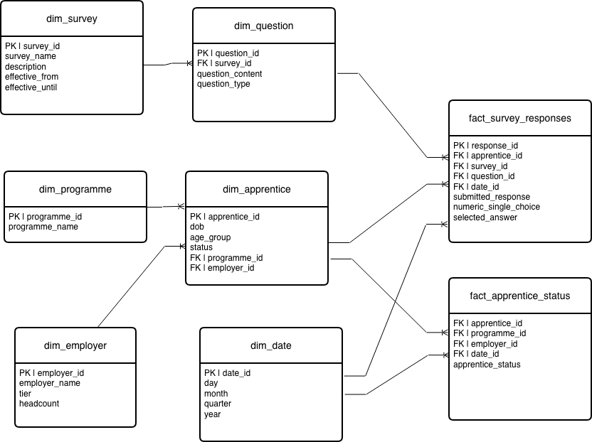

# MultiVerse

.png>)

## purpose
this project standardises apprentice survey data from two systems `Ash` and `Elm` into a unified analytics model for consistent reporting and stakeholder insights

## source overview
`apprentice_users.csv`: apprentice metadata
`ash_*`: Ash survey responses
`elm_*`: Elm survey responses

## transformation steps
1. dbt seed all `.csv` files
2. staging layer
    - light transformation and casting appropriate data types
    - rename and snake v camel case consistency
    - review the data and inspect for any inefficiencies
    - surrogate key e.g. `programme_id`
    - dbt tests
3. dimension model
    - joins and unions that are appropriate from staging models to formulate business context
        - deriving real business understanding at this stage
    - new dbt tests for referencial integrity
    - added aggregation and de-duplication data cleansing
4. fact model
    - operates as a star schema with joining dimensions table
    - case statements for flags and easily identifiable KPI's which can answer busniess questions at a glance
    - dbt tests for new join referencial integrity